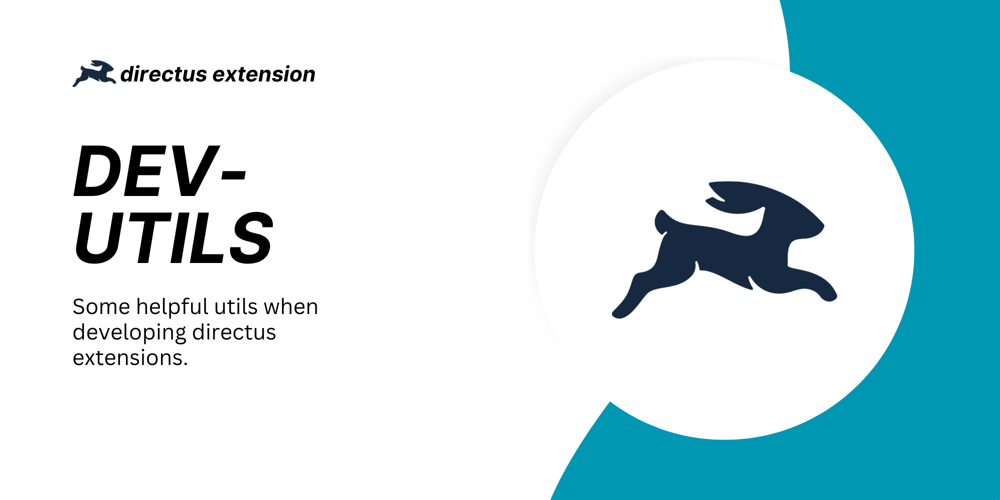

# 🐰 Directus Dev-utils

> [!NOTE]
> 💡 Some helpful utils when developing directus extensions.

> [!WARNING]
> This is not an extension itself! It's a dev-util that can be used by developers while developing extensions.

## 🎉 Features
- **Add migrations from an extension**
- **Require extensions**
- **Require environmental variables**


## ⚙️ Installation
```
npm i -D directus-dev-utils
```

or

```
pnpm i -D directus-dev-utils
```


## Docs & Examples
### Require-env
This helper allows you to make sure a specific env exists. It's recommended to use it in a server start hook. 
The function takes two parameters:
- The name of the env
- An optional config object ([full config options](https://github.com/utomic-media/directus-dev-utils/blob/main/src/classes/HookUtils.ts#L38))

**Example**
```ts
export default ({ filter, action }, apiExtensionContext) => {
	const hookUtils = new HookUtils('<yourExtensionName>', apiExtensionContext);
	
	action('server.start', () => {
		hookUtils.requireEnv('myEnv');
	});
};
```

## Require Extension
This helper allows you to make sure a specific extension exists and is enabled. It's recommended to use it in a server start hook.
The function takes three parameters:
- The bundle name of the extension (`null` if it's not part of an extension)
- The name of the extension
- An optional config object ([full config options](https://github.com/utomic-media/directus-dev-utils/blob/main/src/classes/HookUtils.ts#L62))


**Example**
```ts
export default ({ filter, action }, apiExtensionContext) => {
	const hookUtils = new HookUtils('<yourExtensionName>', apiExtensionContext);
	
	action('server.start', () => {
		hookUtils.requireExtension('directus-extension-field-actions', 'display'); // NOTE: you can add optional options
	});
};
```


## Add migrations
The `MigrationUtils` allows you to add and require migrations from your extension. Please note that the end user still needs to run a sync-command before they can be applied (see [#Sync & run migrations](#sync-&-run-migrations))

### Publish migrations with your extension
1. Add a `./migrations` folder to your extensions `./src` folder
2. Add new migration files to your folder. Make sure to use a unique name. Directus requires the schema: `[identifier]-[name].js` [(read docs)](https://docs.directus.io/extensions/migrations.html#file-name). We recommend to add your extension-name as a prefix, e.g: `20231202A-myExtension-my-custom-migration.js`.
3. Configure your extension to include the folder in the final bundle (see [#Extensions-SDK Configuration](#-extensions-sdk-configuration) if you bundle your extension with the directus-extensions sdk)
4. Create an `MigrationUtils` instance as a top-level function inside the `defineHook` function

**Example**
````ts
import { defineHook } from '@directus/extensions-sdk';
import { HookExtensionContext } from '@directus/extensions';
import { MigrationUtils } from 'directus-dev-utils';


export default defineHook((registerFunctions, apiExtensionContext: HookExtensionContext) => {
	// Init the migrationUtils automatically registeres the emitter, CLI-Command, and Migration check on server startup
	const migrationUtils = new MigrationUtils('gravatar', registerFunctions, apiExtensionContext);
	migrationUtils.initMigrationUtils();
	// That's all - keep coding!
});
````

> [!TIP]
> The `MigrationUtils` class is an extension of `HookUtils`. Therewith you can use all HookUtils functions from a MigrationUtils instance too!

> [!Important]
> When using the dev-utils you can use typescript to write your extensions. They will be transpiled while bundeling. 
> *This may slow down the build process a bit, as we spin up a tsc compiler.*
> 
> Note that imported dependencies in migrations won't be bundled into the final migration! 
> This means that any dependency you use, must also be installed on the final directus project!
>


### Sync & run Migrations
The extensions migrations still needs to be pushed to the directus migrations folder. This dev-utils automatically registeres a cli command for that. When running the following command, all extensions using the dev-uils will sync their migrations to the migrations directory. If a file already exists, it will not be replaced! Afterwards the directus migrations can be applied as usual.

```shell
# Sync all extensions migrations to the directus migration folder
npx directus devUtils syncMigrations

# Apply all new migrations
npx directus database migrate:latest

```


#### 🔧 Extensions-SDK Configuration
If you're building your extension with the directus extensions-sdk  you'll need to create and add the migrations folder to the dist output of the build process. You can do that by installing [`rollup-plugin-copy`](https://www.npmjs.com/package/rollup-plugin-copy) in your extension and [add it as a plugin](https://docs.directus.io/extensions/creating-extensions.html#configuring-the-cli). We already provide a full config for the plugin.

````ts
// extension.config.js
import copy from 'rollup-plugin-copy';
import { ExtensionConfig } from 'directus-dev-utils';

export default {
  plugins: [
    copy(new ExtensionConfig().getRollupCopyConfig()),
  ],
};
````

> [!IMPORTANT]  
> Note that changes to the migrations won't be detected automatically. You'll need to re-build the extension and also manually update the extension on your directus instance after changes. This also applies when using the extension watch/dev mode and the directus auto-reload config.


## Development
- Add this as a file-dependency to a package-json of a directus-extension (e.g `"directus-dev-utils": "file:../../github-utomic/directus-dev-utils"`)
- Run `pnpm i` & `pmpm dev`  on this repo
- Run `pnpm i` & `pmpm dev` on the extension
- Check in the directus project (here you also can install the <u>extension</u> as a local dependency)
- --> repeat (note: `pnpm i` will always re-install local dependencies to make sure they're up to date!)